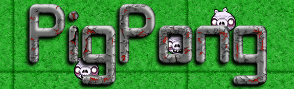

Pig Pong
=======================

## Synopsis

This is a project for the Makerthon week (week 8 at Makers Academy).
We decided to build a realtime game, where you are a farmer and you have to avoid the zombie pigs bouncing around.

## Technologies Used

- JavaScript
- HTML & CSS
- NodeJS
- Phaser
- Mocha, Chai and CasperJS

## Job List

- [x] Character can be hit by the ball
- [x] Multiple balls gets generated after a certain amount of time
- [x] Can register the Highscore

## Favourite Code Snippet

~~~
var game = new Phaser.Game(700, 400, Phaser.AUTO, 'game-mainpage', { preload: preload, create: create, update: update, render: render });

game.physics.startSystem(Phaser.Physics.ARCADE);

group = game.add.group();
group.enableBody = true;  
group.physicsBodyType = Phaser.Physics.ARCADE;
game.time.events.loop(5000, createBall, this);
~~~
This is the part of code where we initialise the game and define how big our canvas will be.
Choose what physics to use and enable the body of the object to collide with other objects.

## Collaborators

- Jack Rubio (http://www.github.com/jackrubio26)
- India Dearlove (http://www.github.com/indiadearlove)
- Hannah Carney (http://www.github.com/hannahcarney)
- Charlie Walsh (http://www.github.com/ciawalsh)
- Matteo Manzo (http://www.github.com/matteomanzo)

## Still to complete/refactor

- [ ] Web Sockets for multiplayer game
- [ ] Character can shoot

## Takeaway

Being able to understand and use new technologies like Phaser, and spent a lot of time designing how to implement the app before we wrote a single line of code.
